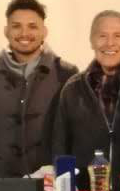

# Image Preprocessing

## Working with difference image analysis

### By Romell Domínguez

## 1. Kernels & Convultions   

## 2. KERAS Preprocessing   

## 3. Identifying objects   

## 4. Image segmentation with Mask R-CNN   

## 5. Objects Detection & Extraction   

    

## 6.Biomedical Analysis   

## 6.Transfer Learning into CNN   

## Requirements

* [Python 3.6](https://www.python.org/downloads/release/python-360/)
* [Jupyter Notebook](http://jupyter.org/)

## License

MIT. See the LICENSE file for the copyright notice.

**2018, August**

